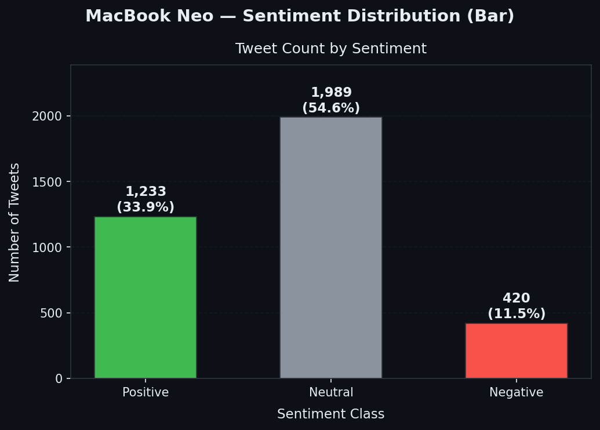
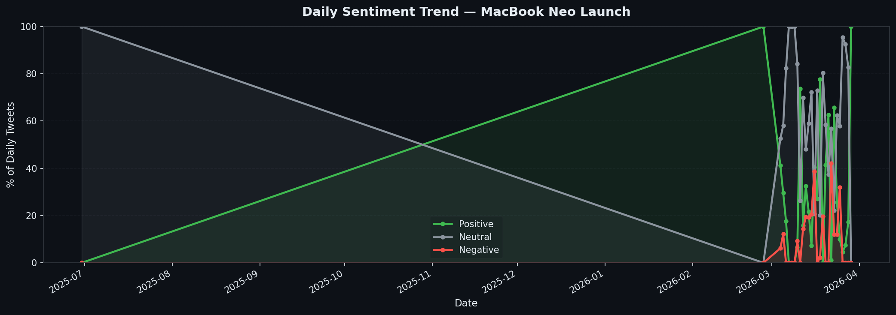
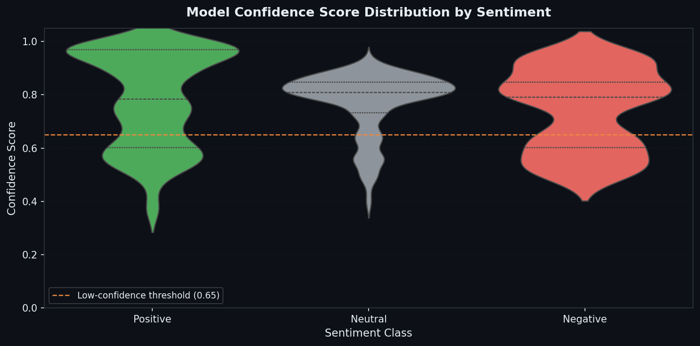
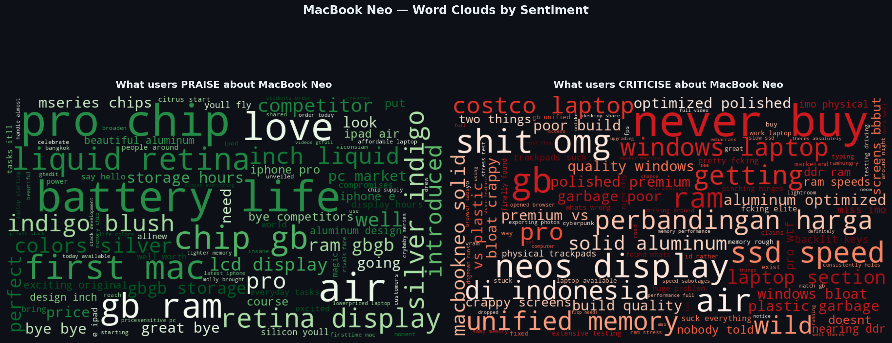

# MacBook Neo — Twitter Sentiment Analysis

A natural language processing pipeline that classifies public Twitter sentiment around the **MacBook Neo** product launch using a fine-tuned RoBERTa transformer model. The project covers the complete data science workflow: data ingestion, text preprocessing, batch inference, and multi-faceted visualisation.

---

## Results at a Glance

| Sentiment | Tweet Count | Share |
|-----------|-------------|-------|
| Neutral   | 1,989       | 54.6% |
| Positive  | 1,233       | 33.9% |
| Negative  | 420         | 11.5% |

Overall reception is net-positive. The majority of discourse is neutral — informational and comparative in nature — with positive sentiment outpacing negative by nearly **3 : 1**.

---

## Project Structure

```
├── Sentiment_MacBook_neo.ipynb   # Main analysis notebook
├── Tweets.csv                    # Raw tweet dataset (not included — see Setup)
├── outputs/
│   ├── sentiment_bar_chart.png
│   ├── sentiment_trend.png
│   ├── confidence_distribution.png
│   └── wordclouds_sentiment.png
└── README.md
```

---

## Methodology

### 1. Data Ingestion

Tweets are loaded from `Tweets.csv` with three core columns: `tweetId`, `content`, and `createdAt`. The pipeline validates column presence before proceeding and produces an early quality report covering total count, date range, missing values, and duplicate detection.

### 2. Text Preprocessing

Each tweet passes through a deterministic cleaning pipeline that performs the following operations in sequence:

- Strips URLs, `RT @user:` retweet prefixes, and `@mentions`
- Removes `#` symbols while preserving the hashtag word
- Drops non-ASCII characters (CJK scripts, unicode symbols)
- Strips digits, punctuation, and collapses whitespace
- Lowercases the resulting string

Rows that produce an empty string after cleaning are removed before inference.

### 3. Sentiment Inference

**Model:** [`cardiffnlp/twitter-roberta-base-sentiment-latest`](https://huggingface.co/cardiffnlp/twitter-roberta-base-sentiment-latest)

RoBERTa-base fine-tuned on approximately 124 million tweets, purpose-built for social media text classification. The model outputs three mutually exclusive classes: `Positive`, `Neutral`, and `Negative`.

| Parameter | Value |
|-----------|-------|
| Batch size | 32 |
| Max sequence length | 128 tokens |
| Inference device | GPU (CUDA) with CPU fallback |
| Low-confidence threshold | 0.65 |

---

## Visualisations

### Sentiment Distribution



### Daily Sentiment Trend



Pre-launch discourse (mid-2025) was almost entirely neutral, consistent with a period of speculation and unconfirmed leaks. At product launch (approximately March 2026), sentiment bifurcated sharply: positive and negative reactions rose simultaneously as hands-on impressions and critical reviews entered the conversation.

### Model Confidence Distribution



Positive predictions exhibit the widest confidence spread, reflecting ambiguous or mildly enthusiastic language that the model assigns probabilistically. Neutral and Negative predictions cluster above the 0.65 threshold, indicating higher model certainty for those classes. The dashed orange line denotes the low-confidence boundary below which predictions may warrant manual review.

### Word Clouds by Sentiment



**Themes driving positive sentiment:** battery life, Liquid Retina display quality, M-series chip performance, colour options (Indigo, Blush), and RAM and storage configurations.

**Themes driving negative sentiment:** unified memory constraints, unfavourable Windows comparisons, build quality concerns, price-to-value perception (notably among Indonesian-language users), SSD speed, and pre-installed software.

---

## Setup

### Prerequisites

```bash
pip install pandas numpy torch transformers nltk wordcloud matplotlib seaborn tqdm
```

### Running the Notebook

1. Upload `Tweets.csv` to Google Drive, or update the file path directly in the notebook.
2. Open `Sentiment_MacBook_neo.ipynb` in Google Colab.
3. Mount Google Drive and run all cells in order.

The notebook automatically detects and uses a GPU where available. For large datasets, GPU inference is strongly recommended.

**Note:** On first run, the model weights (~500 MB) are downloaded from Hugging Face and cached. Subsequent runs load from cache and are significantly faster.

### Expected CSV Schema

| Column      | Type      | Description              |
|-------------|-----------|--------------------------|
| `tweetId`   | string    | Unique tweet identifier  |
| `content`   | string    | Raw tweet text           |
| `createdAt` | timestamp | ISO 8601 creation time   |

---

## Dependencies

| Library                   | Purpose                              |
|---------------------------|--------------------------------------|
| `transformers`            | Hugging Face inference pipeline      |
| `torch`                   | GPU / CPU backend for the model      |
| `pandas` / `numpy`        | Data loading and manipulation        |
| `nltk`                    | Stopword lists for word cloud filter |
| `wordcloud`               | Sentiment word cloud generation      |
| `matplotlib` / `seaborn`  | Chart and figure rendering           |
| `tqdm`                    | Batch inference progress tracking    |

---

## Notes

- The dataset spans **July 2025 to April 2026**, covering the full arc from pre-announcement leaks through post-launch reviews.
- Indonesian-language content (*perbandingan harga*, *di indonesia*) is present in the negative cluster, suggesting that regional price sensitivity is a meaningful driver of criticism in that market.
- Predictions with a confidence score below 0.65 can be filtered out for higher-precision downstream analysis without materially reducing dataset size.


Data Collection — X (Twitter) Scraper

All tweet data used in this project was collected via a custom automated workflow built in n8n, a self-hosted workflow automation platform. No third-party Twitter/X API credentials or paid data providers were used.


Workflow Overview

The scraper workflow, named X_Scraper, was designed and executed on n8n Cloud. It follows a paginated loop architecture to collect tweets in batches and append them incrementally to a Google Sheet, which was then exported as Tweets.csv for use in the analysis notebook.


Workflow Architecture

The workflow is composed of two logical stages:

Stage 1 — Scraping X

NodeTypeRoleWhen clicking "Test workflow"Manual TriggerInitiates the workflow on demandSet CountSetInitialises the tweet counter and pagination cursorCounterSetTracks the running total of collected tweetsGet TweetsHTTP RequestCalls the TwitterScraper API endpoint to fetch a batch of tweets matching the target queryExtract InfoCodeParses the raw API response and extracts relevant fields (tweet ID, text, timestamp)Add to SheetGoogle SheetsAppends the extracted records to the destination spreadsheet

Stage 2 — Checking Count and Pagination

NodeTypeRoleChecking CountIFEvaluates whether the collected count has reached the target (20 items per batch check)No Operation, do nothingNo-opTerminates the loop when the target is metLimitLimitCaps output items passed to the next stageSet IncreaseSetPrepares the incremented counter valueIncrease CountCodeIncrements the pagination counterSet Count and CursorSetUpdates the cursor for the next page request and feeds back into the loop


Query and Scope

Tweets were collected using a keyword query targeting public mentions of MacBook Neo across X. The scraper captured tweet text, unique tweet ID, and creation timestamp for each record. Collection ran across multiple executions spanning the period July 2025 to April 2026, covering pre-launch speculation through post-launch user reviews.


Output

Collected records were appended in real time to a Google Sheet (visible in the browser tab labelled Tweets — Google Sheets during workflow execution). The final sheet was exported as:

Tweets.csv

This file serves as the raw input to Sentiment_MacBook_neo.ipynb.


Notes


The workflow was executed manually via the Execute Workflow button in the n8n editor.
Each successful run is confirmed by the n8n status notification: Workflow executed successfully.
The paginated loop ensures continuity across large result sets by maintaining a cursor between batches.
Raw data was not filtered or cleaned at the collection stage; all preprocessing is handled within the analysis notebook.
